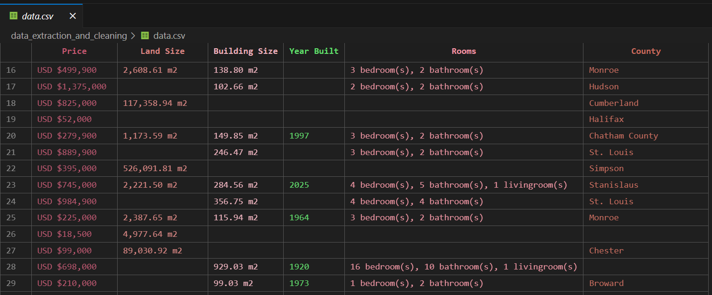
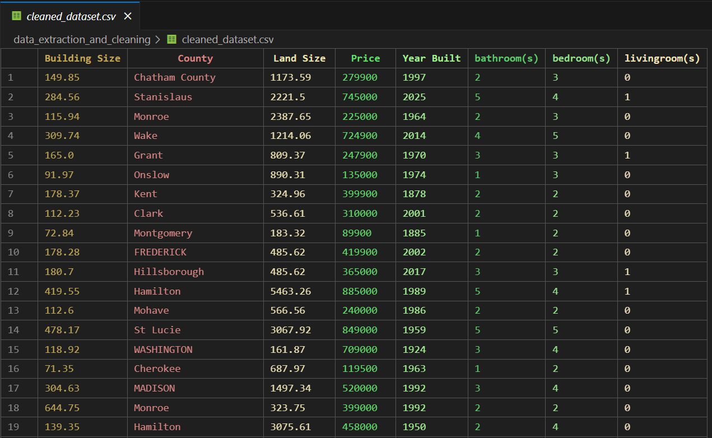

# 🏡 US House Price Prediction
> An end-to-end machine learning project to predict house prices in the United States using real-world data scraped from property listing websites.

## 📌 Introduction
House prices in the United States vary widely depending on factors such as location, number of rooms, lot size, and other property features. Having a reliable predictive system can help **buyers**, **sellers**, and **real estate investors** make informed decisions.

This project aims to build a **full end-to-end machine learning pipeline** that:
1. **Extracts housing data** from online property listing websites.  
2. **Cleans and prepares** the data for machine learning.  
3. **Explores and analyzes** the data to find key price-driving factors.  
4. **Builds a predictive model** (using XGBoost).  
5. **Deploys the model with FastAPI** into a user-friendly web application where users can input house details and instantly get a price estimate.

--- 

##  Part 1 – Data Extraction

For the data source, I scraped property listings from [realestate.com](https://www.realestate.com.au/international/us/)

### ⚙️ Tools & Libraries
- **[crawl4ai](https://github.com/unclecode/crawl4ai)** – to crawl pages programmatically.  
- **[BeautifulSoup](https://www.crummy.com/software/BeautifulSoup/)** – to parse and extract structured data from HTML.  

### 📝 Workflow
1. **Crawl pages** from the real estate website using `crawl4ai`, look for House Details Cards and save them to [file](data_extraction_and_cleaning/urls.txt). (Check code [here](data_extraction_and_cleaning/get_prooperty_cards.py))  
2. **Crawl House Details Cards** (Check code [here](data_extraction_and_cleaning/scrape_property_cards.py))  
3. **Parse HTML** with `BeautifulSoup` to extract details such as:  
   - Price  
   - Land Size  
   - Building Size  
   - Year Built 
   - Rooms
   - County
4. Store the extracted data into a **CSV file** for further processing.

### 💻 Example Code Snippet
```python
async def main(): 
    browser_config = BrowserConfig(headless=True, verbose=False)
    run_config = CrawlerRunConfig(
        cache_mode=CacheMode.BYPASS,
        check_robots_txt=True,
        stream=False
    )
    
    dispatcher = MemoryAdaptiveDispatcher(
        memory_threshold_percent=70.0,
        check_interval=1.0,
        max_session_permit=10,
        monitor=CrawlerMonitor()
    )
    
    columns = ["Price", "Land Size", "Building Size", "Year Built", "Rooms", "County"]
    df = pd.DataFrame(columns=columns)
    with open("urls.txt", "r") as f: 
        urls = [f"https://www.realestate.com.au{line.rstrip()}" for line in f]
                
    async with AsyncWebCrawler(config=browser_config) as crawler: 
        results = await crawler.arun_many(
            urls=urls, 
            config=run_config,
            dispatcher=dispatcher,
            return_format="html"
        )
        for result in results: 
            if result.success: 
                df =  proccessing(result, df)
            else: 
                print(f"Crawling {result.url} Failed, Error: {result.error_message}")
                
    df.to_csv("data.csv", index=False)

asyncio.run(main())
```
Because crawling multiple pages at once is I/O boud, i used the ***arun_many()*** function that leverage asynchronous I/O parallelism for faster crawling

## Example of the extracted data : 


##  Part 2 – Data Cleaning

### ⚙️ Tools & Libraries
- **[pandas](https://pandas.pydata.org/)** – for data cleaning, transformation, and feature preparation. 

### 📝 Cleaning steps (Check code [here](data_extraction_and_cleaning/data_cleaning.ipynb))
1. ***Remove missing values*** – Dropped incomplete rows where essential details (like price, location or Building size) were missing.
2. ***Convert data types*** – Converted Price, Land Size and Building Size features to numerical format (int/float) and room counts to integers.
3. Export cleaned dataset into a new [CSV](data_extraction_and_cleaning/cleaned_dataset.csv).



