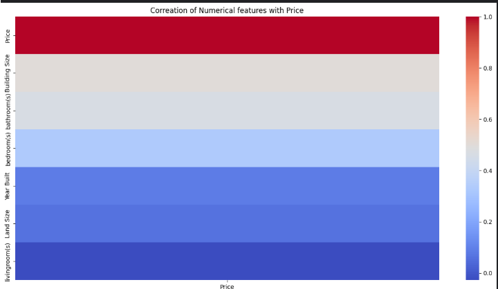
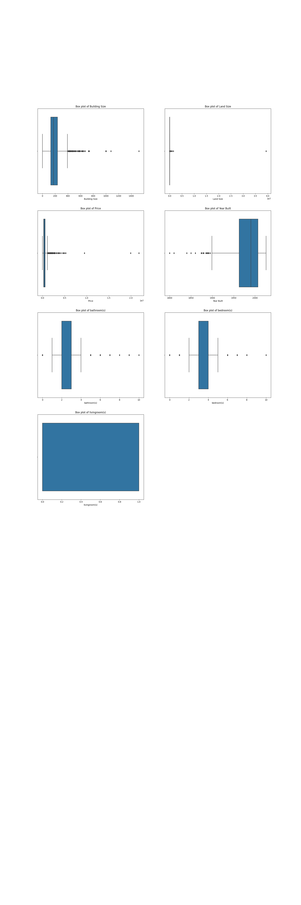
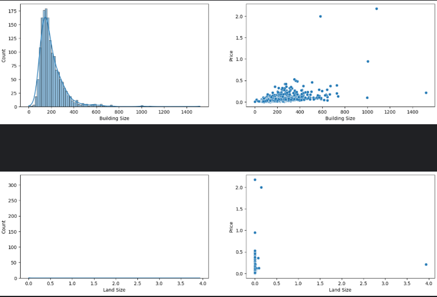
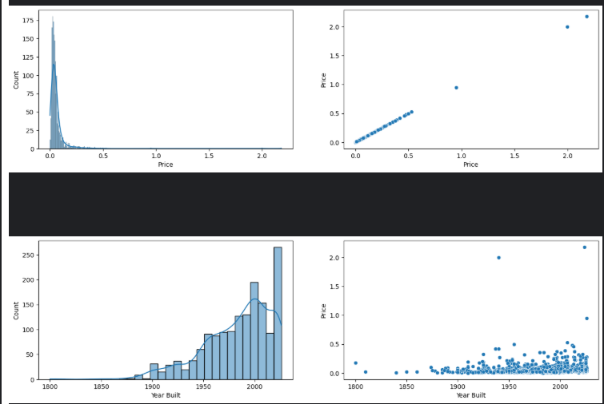
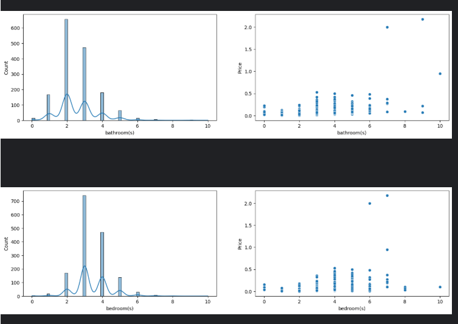
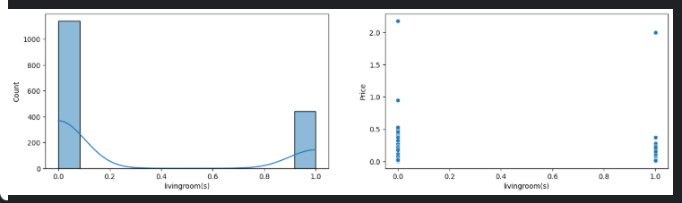
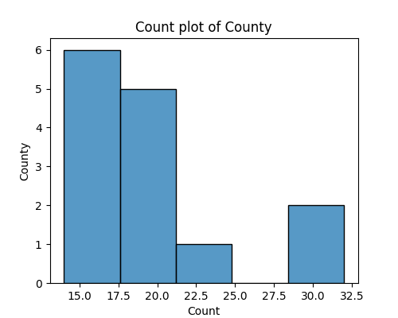

#  US House Price Prediction
> An end-to-end machine learning project to predict house prices in the United States using real-world data scraped from property listing websites.

##  Introduction
House prices in the United States vary widely depending on factors such as location, number of rooms, lot size, and other property features. Having a reliable predictive system can help **buyers**, **sellers**, and **real estate investors** make informed decisions.

This project aims to build a **full end-to-end machine learning pipeline** that:
1. **Extracts housing data** from online property listing websites.  
2. **Cleans and prepares** the data for machine learning.  
3. **Explores and analyzes** the data to find key price-driving factors.  
4. **Builds a predictive model** (using XGBoost or RandomForest).  
5. **Deploys the model with FastAPI** into a user-friendly web application where users can input house details and instantly get a price estimate.

--- 

##  Part 1 – Data Extraction

For the data source, I scraped property listings from [realestate.com](https://www.realestate.com.au/international/us/)

###  Tools & Libraries
- **[crawl4ai](https://github.com/unclecode/crawl4ai)** – to crawl pages programmatically.  
- **[BeautifulSoup](https://www.crummy.com/software/BeautifulSoup/)** – to parse and extract structured data from HTML.  

###  Workflow
1. **Crawl pages** from the real estate website using `crawl4ai`, look for House Details Cards and save them to [file](data_extraction_and_cleaning/urls.txt). (Check code [here](data_extraction_and_cleaning/get_prooperty_cards.py))  
2. **Crawl House Details Cards** (Check code [here](data_extraction_and_cleaning/scrape_property_cards.py))  
3. **Parse HTML** with `BeautifulSoup` to extract details such as:  
   - Price  
   - Land Size  
   - Building Size  
   - Year Built 
   - Rooms
   - County
4. Store the extracted data into a **CSV file** for further processing.

###  Example Code Snippet
```python
async def main(): 
    browser_config = BrowserConfig(headless=True, verbose=False)
    run_config = CrawlerRunConfig(
        cache_mode=CacheMode.BYPASS,
        check_robots_txt=True,
        stream=False
    )
    
    dispatcher = MemoryAdaptiveDispatcher(
        memory_threshold_percent=70.0,
        check_interval=1.0,
        max_session_permit=10,
        monitor=CrawlerMonitor()
    )
    
    columns = ["Price", "Land Size", "Building Size", "Year Built", "Rooms", "County"]
    df = pd.DataFrame(columns=columns)
    with open("urls.txt", "r") as f: 
        urls = [f"https://www.realestate.com.au{line.rstrip()}" for line in f]
                
    async with AsyncWebCrawler(config=browser_config) as crawler: 
        results = await crawler.arun_many(
            urls=urls, 
            config=run_config,
            dispatcher=dispatcher,
            return_format="html"
        )
        for result in results: 
            if result.success: 
                df =  proccessing(result, df)
            else: 
                print(f"Crawling {result.url} Failed, Error: {result.error_message}")
                
    df.to_csv("data.csv", index=False)

asyncio.run(main())
```
Because crawling multiple pages at once is I/O boud, i used the ***arun_many()*** function that leverage asynchronous I/O parallelism for faster crawling

## Samples from the Extracted data : 


--- 

##  Part 2 – Data Cleaning

###  Tools & Libraries
- **[pandas](https://pandas.pydata.org/)** – for data cleaning, transformation, and feature preparation. 

###  Cleaning steps (Check code [here](data_extraction_and_cleaning/data_cleaning.ipynb))
1. ***Remove missing values*** – Dropped incomplete rows where essential details (like price, location or Building size) were missing.
2. ***Convert data types*** – Converted Price, Land Size and Building Size features to numerical format (int/float) and room counts to integers.
3. Export cleaned dataset into a new [CSV](data_extraction_and_cleaning/cleaned_dataset.csv).


---

##  Part 3 – Exploratory Data Analysis (EDA)

Notebook: [EDA](EDAandMODEL_TRAINING/EDA.ipynb)

Understanding the data is a crucial step before building models. In this phase, I performed **descriptive analysis** and created visualizations to explore relationships between features and the target variable (`Price`).

###  Tools & Libraries
- **[Pandas](https://pandas.pydata.org/)** – data manipulation and summary statistics.  
- **[NumPy](https://numpy.org/)** – numerical operations.  
- **[Matplotlib](https://matplotlib.org/)** – basic visualization.  
- **[Seaborn](https://seaborn.pydata.org/)** – advanced plots and statistical visualizations.  

###  EDA Steps & Visualizations
1. **Correlation Heatmap**  
   - Visualized the correlation matrix of numerical features and highlighted their correlation with `Price`.  
   - This helped identify which features are most strongly associated with house prices.  
   - 

2. **Distribution of Numerical Variables (Boxplots)**
    - Checked the distributions and outliers in numerical variables (e.g., bedrooms, bathrooms, lot size).
    - 


3. **Scatter Plots with Target Variable(Price)**
    - Created scatter plots to visualize relationships between numerical features and house prices.
    - Useful to detect linear/non-linear relationships and heteroscedasticity.
    - 
    - 
    - 
    - 
    
4. **Categorical Variable (County) Distribution**
    - lotted a histogram showing the top 15 frequency of listings per county .
    - 

---

##  Part 4 – Model Training 

Notebook: [EDA](EDAandMODEL_TRAINING/training.ipynb)


###  Feature Engineering 
1. **New Features Added**
    - **TotalRooms** = Bedrooms + Bathrooms + LivingRooms
    - **HouseAge** = Current Year – YearBuilt

2. **Encoding Categorical Variables**
    - Used OneHotEncoder() for nominal encoding of County.
    - Saved the transformed dataset into [dataset](EDAandMODEL_TRAINING/new_features_added.csv).
    
####  Example Code Snippet 
    ```python 
    ohe = OneHotEncoder()
    county_col = df["County"].values
    county_col = county_col.reshape((-1,1))
    county_col_encoded = ohe.fit_transform(county_col).toarray()
    county_encoded_df = pd.DataFrame(county_col_encoded)
    df_encoded = pd.concat([df, county_encoded_df], axis=1)
    df_encoded.drop("County", axis=1, inplace=True)
    ```

###  Building the Base Model 
1. Linear Regression (Baseline Model)
    - Tried a simple linear regressor.
    - Results:
        - Train R²: 0.8872
        - Test R²: -451953.7172

    - Conclusion: Extreme overfitting, poor generalization. 
2. Random Forest Regressor
    - Used **RandomForestRegressor** with GridSearch and a StandardScaler pipeline 
    - Results : 
        - Train R²: 0.3 
        - Test R²: 0.2 
    - Conclusion: Much better than linear regression, but still room for improvement.
    
####  Example Code Snippet 
```python 
def grid_search(estimator, params):
    
    scaler = ColumnTransformer(
        transformers=[("numeric", StandardScaler(), numeric_features)],
        remainder = "passthrough"
    )
    
    search = GridSearchCV(
        estimator,
        param_grid=params,
        cv=5,
        scoring="r2",
        n_jobs=-1
    )

    pipeline = Pipeline([
        ("scaler", scaler),
        ("regressor", search)
    ])
    
    pipeline.fit(X_train, y_train)
    
    train_r2 = pipeline.score(X_train, y_train)
    test_r2 = pipeline.score(X_test, y_test)
    
    print("Train r2: ", train_r2)
    print("Test r2: ", test_r2)
    return pipeline
    
params = {"n_estimators": [100],
          "max_depth": range(5, 25),
          "min_samples_split": [2, 5, 10, 15],
          "min_samples_leaf": [1, 2, 5, 10]}

model = grid_search(RandomForestRegressor(), params)
```
### Next Steps
The **Random Forest Regressor** will be used as the base deployed model, and I will iterate over it later by: 
- Tuning hyperparameters 
- Trying advanced models (XGBoost, LightGBM ...) 
- Performing feature selection 
- Handling non-linear interactions better 
